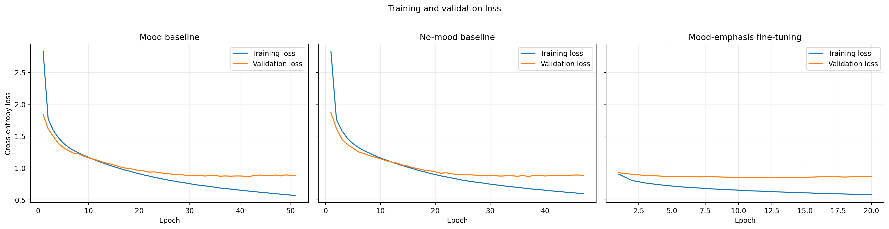
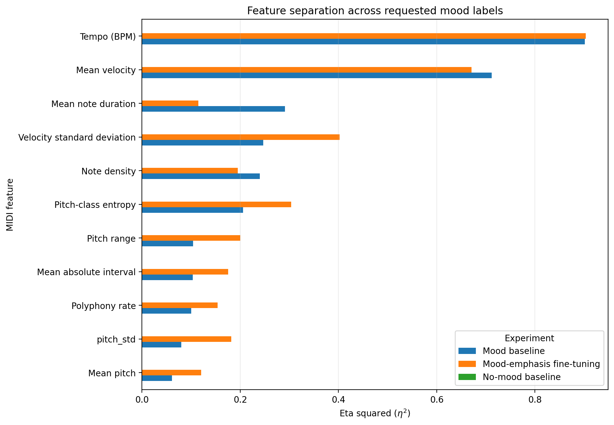

# Mood-Conditioned Symbolic MIDI Generation with ComMU

Deep Learning Project Work by **Alessio La Torre** (student ID `0001195123`).

This repository contains a notebook-first implementation of an autoregressive Transformer for short, single-track symbolic music generation. The model receives musical metadata and, optionally, a mood condition, then generates a REMI token sequence that is decoded into MIDI.

## Research question

> Does adding a heuristic mood token produce measurable changes in generated MIDI when the remaining metadata and sampling seed are fixed?

The project compares:

1. a mood-conditioned Transformer;
2. an otherwise identical model without mood;
3. a short fine-tuning stage that repeats the mood token three times.

## Important methodological note

ComMU does not provide human emotion annotations. The six labels used in this project—`calm`, `joy`, `sadness`, `mystery`, `tension` and `danger`—are pseudo-labels derived from key mode, tempo and mean MIDI velocity.

The reported heuristic agreement therefore measures consistency with the labelling rule. It is **not** human emotion-recognition accuracy.

## Repository structure

```text
.
├── notebooks/
│   └── commu_mood_conditioned_generation.ipynb
├── results/
│   ├── three_model_summary.csv
│   ├── feature_separation.csv
│   ├── mood_feature_means.csv
│   ├── real_generated_standardized_differences.csv
│   ├── dataset_summary.csv
│   └── split_summary.csv
├── figures/
│   ├── training_curves.png
│   ├── feature_separation_three_models.png
│   └── training_loss_*.png
├── data/external/              # ignored; official ComMU checkout
├── artifacts/                  # ignored; checkpoints, MIDI, audio, caches
├── requirements.txt
└── .gitignore
```

## Pipeline

```text
ComMU metadata and MIDI files
        ↓
Cinematic subset filtering
        ↓
Heuristic mood pseudo-labels
        ↓
Balanced training split
        ↓
REMI tokenization and metadata prefix
        ↓
Causal Transformer language model
        ↓
Constrained autoregressive generation
        ↓
Validity, originality and controllability evaluation
```

## Dataset and preprocessing

The official ComMU metadata contains 11,144 connected MIDI files. The project retains examples satisfying:

- genre: `cinematic`;
- length: 4 or 8 measures;
- time signature: 4/4;
- sample rhythm: `standard`;
- no additional instrument or track-role restriction.

After filtering, 5,957 examples remain, with 104 instrument labels and 6 track roles.

Mood pseudo-labels are computed from a normalized arousal score:

```text
arousal = 0.60 × normalized BPM + 0.40 × normalized mean velocity
```

Major-key examples are divided into `calm` and `joy` at the median arousal value. Minor-key examples are divided into `sadness`, `mystery`, `tension` and `danger` using arousal quartiles. Normalization ranges and thresholds are fitted only on the official training portion.

The project split contains 1,620 training examples, 180 validation examples and 324 final test examples. The training set is balanced at 270 examples per mood.

## Tokenization and conditioning

MIDI files are serialized with the REMI tokenizer from MidiTok. Musical event types include bars, positions, tempo, time signature, MIDI program, pitch, velocity and duration.

The conditioned input sequence is:

```text
[mood, genre, track role, instrument, measures, BOS, music tokens, EOS]
```

The no-mood ablation removes only the mood token. Sequences use dynamic padding and a maximum context length of 512 tokens. Cross-entropy is computed only on the musical continuation, not on the conditioning prefix.

## Model architecture

| Setting | Value |
|---|---:|
| Embedding dimension | 192 |
| Transformer layers | 4 |
| Attention heads | 6 |
| Feed-forward dimension | 768 |
| Dropout | 0.10 |
| Activation | GELU |
| Maximum sequence length | 512 |
| Mood-model parameters | 1,993,152 |
| No-mood parameters | 1,991,808 |

The implementation uses a `TransformerEncoder` with a causal attention mask, learned token and positional embeddings, pre-normalized layers and tied input/output embeddings.

## Training

Both baselines use:

- AdamW;
- learning rate `3e-4`;
- weight decay `1e-2`;
- batch size 8;
- gradient clipping at 1.0;
- maximum 100 epochs;
- early stopping after 10 epochs without validation-loss improvement.

The mood-emphasis experiment initializes from the best mood-conditioned checkpoint, repeats the mood token three times and fine-tunes for at most 20 epochs at learning rate `1e-4`.



## Controlled generation protocol

All non-mood metadata is fixed:

```text
genre       = cinematic
track role  = main_melody
instrument  = string_ensemble
length      = 8 measures
```

Ten samples are generated for each of the six labels. For each sample index, the same seed is reused across labels and models. Sampling uses temperature 1.0, top-k 30 and top-p 0.95, while token transitions are constrained by the REMI transition graph.

## Main results

| Model | Best val. loss | Test loss | Test PPL | Token acc. | Valid MIDI | Mood agreement | Sequence change | Exact copies |
|---|---:|---:|---:|---:|---:|---:|---:|---:|
| Mood baseline | 0.8664 | 1.0161 | 2.7625 | 0.7055 | 1.000 | 0.6167 | 1.000 | 0.000 |
| No-mood baseline | 0.8733 | 1.0186 | 2.7693 | 0.6958 | 1.000 | 0.1667 | 0.000 | 0.000 |
| Mood-emphasis fine-tuning | 0.8573 | 1.0240 | 2.7844 | 0.7037 | 1.000 | 0.6500 | 1.000 | 0.000 |

The next-token metrics of the two baselines are very similar. The controlled generation metrics provide stronger evidence:

- the no-mood model produces identical outputs across requested labels when the seed and other metadata are fixed;
- both conditioned variants change the sequence for every tested seed;
- heuristic agreement increases from 16.67% to 61.67%, then to 65.00% after fine-tuning;
- every generated file is valid and no exact training copy is detected;
- mean maximum 8-gram Jaccard similarity remains low (`0.0410–0.0556`).

The fine-tuning stage improves controllability but slightly worsens test perplexity. This suggests a small trade-off between stronger condition influence and general next-token modelling.

## Feature separation



Tempo is the most strongly separated feature, followed by velocity. This is expected because both directly contribute to the pseudo-label arousal score. Fine-tuning also increases separation in pitch-class entropy, note density, mean pitch and velocity-related features.

These results show controllable changes in measurable musical attributes. They do not independently prove that listeners perceive the intended emotion.

## Installation

### Local environment

```bash
git clone <your-repository-url>
cd commu-mood-conditioned-midi-generation
python -m venv .venv
source .venv/bin/activate          # Windows: .venv\Scripts\activate
python -m pip install --upgrade pip
pip install -r requirements.txt
jupyter lab
```

Git LFS is required because the official ComMU repository stores the MIDI archive through LFS. FluidSynth and a General MIDI SoundFont are optional for audio playback; MIDI generation and quantitative evaluation do not require audio rendering.

### Google Colab

Clone the repository in Colab, open the notebook and execute the environment cell. The notebook can optionally mount Google Drive for persistent checkpoints.

## Running the project

Open:

```text
notebooks/commu_mood_conditioned_generation.ipynb
```

Execute the notebook in order. The first complete run will:

1. clone the official ComMU repository with Git LFS;
2. extract the MIDI archive;
3. build mood labels and project splits;
4. tokenize and cache sequences;
5. train or resume the three experiments;
6. generate the controlled evaluation set;
7. save metrics, MIDI files, rendered audio and comparison tables under `artifacts/`.

The full experiment is computationally expensive. Checkpoints and the latest training state are saved so interrupted runs can resume.

## Reproducibility

- Global seed: `42`.
- Identical train/validation/test rows across models.
- Identical architecture and optimizer for the two baselines.
- Identical random seed across requested labels for every paired generation sample.
- Best-validation and latest checkpoints stored separately.
- Configuration and condition vocabulary saved inside each experiment directory.

## What is not included in Git

The following are excluded because of size or external licensing:

- the ComMU dataset;
- token caches;
- trained checkpoints;
- generated MIDI and WAV files;
- full experiment artifact directories.

Small result summaries and figures from the completed run are included under `results/` and `figures/`.

## Limitations

1. Mood labels and the automatic agreement metric share the same heuristic variables.
2. Generation is single-track and short-form.
3. Instrument control is enforced only in a separate listening copy when the model omits the MIDI Program event.
4. The musical domain is limited to cinematic, standard-rhythm, 4/4 examples of four or eight measures.
5. No completed human listening study is included.
6. The narrative-to-mood interface is keyword-based, not a trained NLP model.

## Future work

The main priority is a human evaluation of perceived mood, coherence and pleasantness. Other extensions include an auxiliary mood-classification objective, human-labelled emotion data, metadata-matched real comparisons, longer multi-track generation and a trained text-to-mood module for game scenes.

## References

1. H. Lee et al., “ComMU: Dataset for Combinatorial Music Generation,” *NeurIPS*, 2022.
2. Y.-S. Huang and Y.-H. Yang, “Pop Music Transformer: Beat-based Modeling and Generation of Expressive Pop Piano Compositions,” *ACM Multimedia*, 2020.
3. N. Fradet et al., “MidiTok: A Python Package for MIDI File Tokenization,” arXiv:2310.17202, 2023.
4. A. Vaswani et al., “Attention Is All You Need,” *NeurIPS*, 2017.
5. A. Paszke et al., “PyTorch: An Imperative Style, High-Performance Deep Learning Library,” *NeurIPS*, 2019.

## Dataset licence

ComMU is distributed for non-commercial research under CC BY-NC-SA 4.0. Consult the official repository before redistributing data or trained artifacts.
